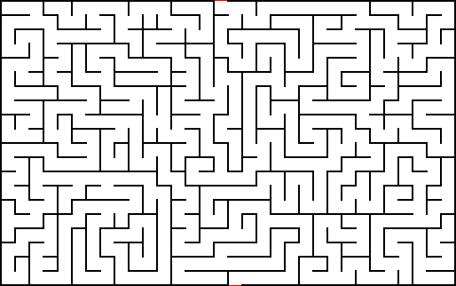
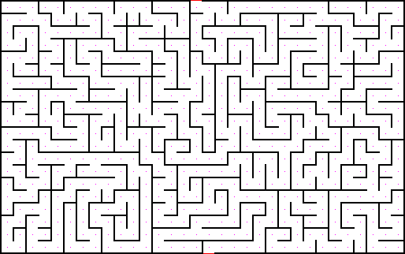
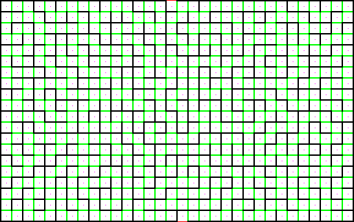
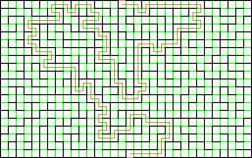

# Maze-Solver
A Depth-First-Search based Maze Solver

## Description
Implemented a Maze-Solver to extract information from a given maze and transform the maze into a graph. Applied DFS from the start-node to find the path to end node while saving the whole search.

## Building graph from the maze

### Finding start and exit

### Locating cells of the maze i.e. Graph-nodes

### Finding edges for each cell/node

## Depth-First-Search on the Maze/Graph
### Search

### Solution

